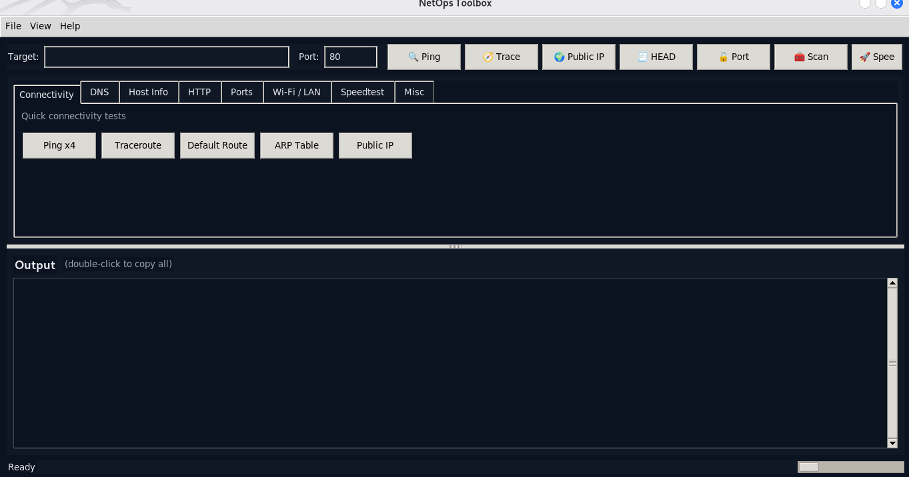

# 🧰 NetOps Toolbox — Attractive GUI Edition (Full)

A modern, cross‑platform **Python GUI** for everyday NetOps: Ping, Traceroute, DNS, IP/Route/ARP, HTTP HEAD, Port Check/Scan, Wi‑Fi info — **plus a Speedtest tab**. Beautiful Tk/ttk UI with light/dark themes, toolbar, status bar, and non‑blocking execution.

## ✨ Features
- Clean UI: toolbar, split layout, themed cards, toasts
- Tabs: Connectivity, DNS, Host Info, HTTP, Ports, Wi‑Fi/LAN, **Speedtest**, Misc
- Shortcuts: `Ctrl+S` save, `Ctrl+L` clear, `Ctrl+T` theme, `F5` ping, `F6` traceroute
- Save output to file; copy all on double‑click

## ⚙️ Install
**Python 3.8+** required.

Linux (recommended tooling):
```bash
sudo apt update
sudo apt install -y curl traceroute dnsutils iproute2 net-tools wireless-tools network-manager
# Optional:
sudo apt install -y speedtest-cli nmap python3-tk
```
Python deps (optional fallback for HTTP/Public IP):
```bash
pip install requests
```

## 🚀 Run
```bash
python3 netops_toolbox.py
```

## 🧩 What tools are used
- `curl` — HTTP HEAD & public IP (fallback to `requests`)
- `dig`/`dnsutils` or `nslookup` — DNS
- `traceroute`/`tracepath`/`tracert` — traceroute
- `ip`/`ifconfig`, `route` — addresses & routes
- `nmcli`/`iwconfig` — Wi‑Fi details
- `speedtest` (Ookla) or `speedtest-cli` — Speedtest tab

## 🛠️ Troubleshooting
- **Tkinter missing** → `sudo apt install python3-tk`
- **No speedtest** → `sudo apt install speedtest-cli` (or install Ookla CLI)
- **Wi‑Fi info empty** → install `nmcli` (NetworkManager) or `wireless-tools`
- **Windows output differs** → expected; commands vary by OS

## 📜 License
Author : **SR33-R4G** — © 2025 All Rights Reserved.


 

